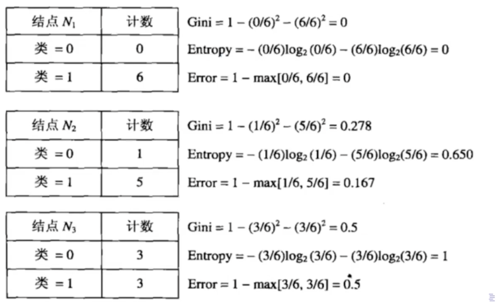
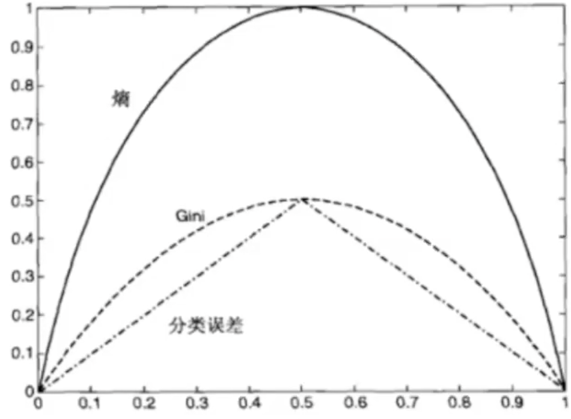

# Week 2: kNN & Decision Tree

[TOC]

# Decision Tree

原则上，任意数据集所有特征都可以用来分枝。不同节点可以组合。有无限多树。

但是这些树总有一颗比其他树分类效力都好，被称为**全局最优树**。

> **全局最优：**经过组合形成的，总体来说效果最好的模型
> **局部最优：**每一次分枝都向最好的分类效果分枝，无法确定是否最优

## ID3 算法

### Impurity

决策树需要寻找出最佳的分枝方法，用与衡量最佳的指标叫 **Impurity/不纯度**。

在分枝中，Leaf nodes 标签某一类标签占比越大，越纯，反之。
如果没有哪一类标签比例很大，则不纯。

分布为 $(0\%, 100\%)$ 的节点有 0 不纯性。
均衡分布 $(50\%, 50\%)$ 的节点有最高的不纯性。

> 不纯度基于 Leaf 计算，因此树所有节点都有 Impurity。且子节点的 Impurity $\leq$ 父节点的

我们可以用**误差率（Classification Error）**进行 Impurity 运算。
$$
\text{Classification Error}(t)=1-\max_{i=1}[p(i\mid t)]
$$

> 可以把纯度看作，这一个节点下，所有Leaf 类别中，占比最大的类别的比例。即：
> $$
> \begin{align}
> \text{Purity}
> &= \frac{\max_{i=0}^c | L_c |}{|L|}
> \\
> &= \max_{i=0}^c \frac{| L_c |}{|L|}\\
> &= \max_{i=0}^c [p(c\mid t)]
> \end{align}
> $$
> 而 Impurity 可以当作其补值：
> $$
> \begin{align}
> \text{Impurity}
> &= 1-\text{Purity}
> \\
> &= 1-\max_{i=0}^c [p(c\mid t)]
> \end{align}
> $$
> $t$ 为节点，$p(i\mid t)$ 表示给定节点 $t$ 中属于类别 $i$ 的样本所占比例。CE 越低，纯度越高。

ID3 中使用 Information Gain，其有 Entropy 推导而来：
$$
\text{Entropy}(t)=-\sum_{i=0}^{c-1}p(i\mid t)\log_2p(i\mid t)
$$
$c$ 表示叶子节点的类别指数。

CART 则使用 Gini 指数：
$$
\text{Gini} = 1- \sum_{i=0}^{c-1}[p(i\mid t)]^2
$$

ID3 决策树在做决策切割时，会尽可能选择 Entropy 最小的特征进行切分。

### Weight

父节点下可以有多个子节点，每个子节点有自己的 Entropy。

父节点 Entropy 与子节点 Entropy 之差 = 父节点Entropy - 子节点信息熵的加权平均。

权重是单叶子节点所占样本量 / 父节点总样本量。
$$
I(\text{child})=\sum_{j=1}^k\underbrace{\frac{N(v_j)}{N}}_\text{Weight}\text{Impurity}(v_j)\\
$$
不纯度下降，则可以表达为：
$$
\Delta =I(\text{parent}) - I(\text{child})
$$
最大化增益（$\max I_G$）等价于最小化子节点 Impurity 的加权平均（父节点固定）。信息熵的差就是所谓的 Information Gain。
$$
\max I_G=I(\text{parent}) - \min I(\text{child})
$$

### 局限性

1. 不能处理连续变量
2. 没有 pruning 很容易过拟合

## C4.5

引入 IV (Information Value) 来修正 IG 的计算方法。增加随分类变量水平的 penalty。
$$
\text{Information Value} = -\sum_{i=1}^{k} P(v_i)\log_2 P(v_1)
$$

## Reference

- Bilibili: 机器学习---决策树模型 https://www.bilibili.com/video/BV1BE411c7jB/

