# Lecture 3: Evaluation

[TOC]

## Hold-out 法

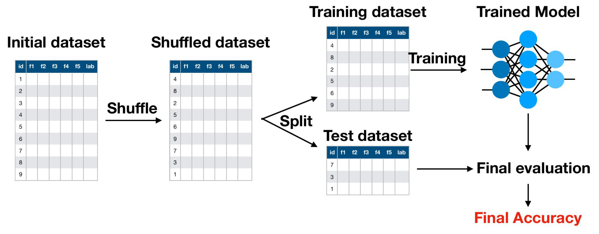

### Hyperparameter Tuning

**Hyperparameter:** 训练前选择的参数（kNN中的k）

**Overall Objective：**寻找拥有最好性能的 Hyperparameter

**Motivation：**寻找在未知数据上最好的 Hyperparameter（泛化性能）

#### 不同的 Approach

**最原始的 Approach：**

- 在训练数据集上尝试不同的值，然后根据训练数据集的准确性选择最佳值（然后在测试数据集上进行评估 (然后在测试数据集上进行评估）
- **问题： 通常不能很好地泛化**

**错误的方法：**

- 在训练数据集上尝试不同的值，然后根据测试数据集的准确性选择最佳值。
- **问题：** 测试数据集现在是你训练过程的一部分（因为你根据它做出了决定），因此我们无法评估你的算法如何推广到未知数据。

**正确的方法：**

- 将数据集分为三部分：**Training/Validation/Test**
- 在 60%/20%/20% 和 80%/10%/10% 之间进行常见分割
- 在训练数据集上尝试不同的 Hyperparameter，然后根据验证数据集上的准确率选择最佳值。在测试数据集上进行最终评估。
- **优点：**超参数的选择考虑到了模型的泛化方式，而且最终评估仍然只使用以前未见过的数据。

保留在验证集上产生最大性能的分类器（本例中为使用 35 个隐藏神经元训练的分类器）。
这叫做hyperparameter tuning/optimization，因为你选择的参数集产生了最好的分类器

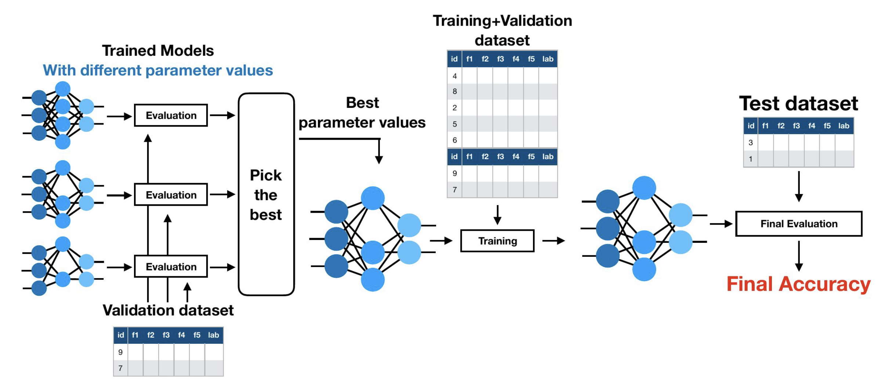

在寻找到最好模型的超参数，你可以使用该训练的模型或者合并 Validation 和 Train训练一个新模型。最终的 Evaluation 永远在测试集。

## Cross-validation

当我们有大量示例时，将其划分为训练/验证/测试数据集就足够了。
当我们只有少量可用数据集时，一个好的替代方法是交叉验证。

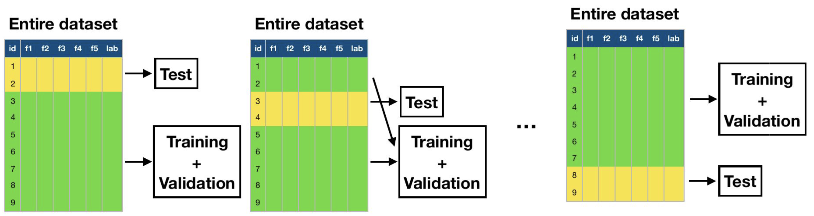

将数据集分成 k 个（通常为 10 个）相等的折叠/分割。使用 k-1 个折叠进行训练+验证，一个折叠进行测试。
● 迭代 k 次，每次测试数据的不同部分。
● 然后可以对所有 k 个保留测试集的性能进行平均
$$
\text{Global Error Estimate} = \frac{1}{N} \sum_{i=1}^N e_i
$$

### Hyperparamter Tuning

#### Approach 1

如果我们需要 estimate 超参数，则需要划分 Validation Set

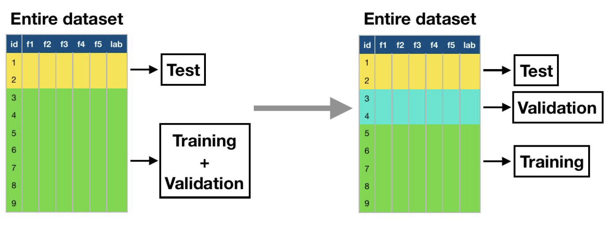

- 每次迭代使用 1 fold 进行测试，1 fold进行验证，k-2 fold 进行训练。
- 每当我们使用多个训练集时，我们都在评估算法，而不是特定模型。
- 我们在每个 fold 中找到一组不同的最佳参数。

#### Approach 2: Nested k-Fold

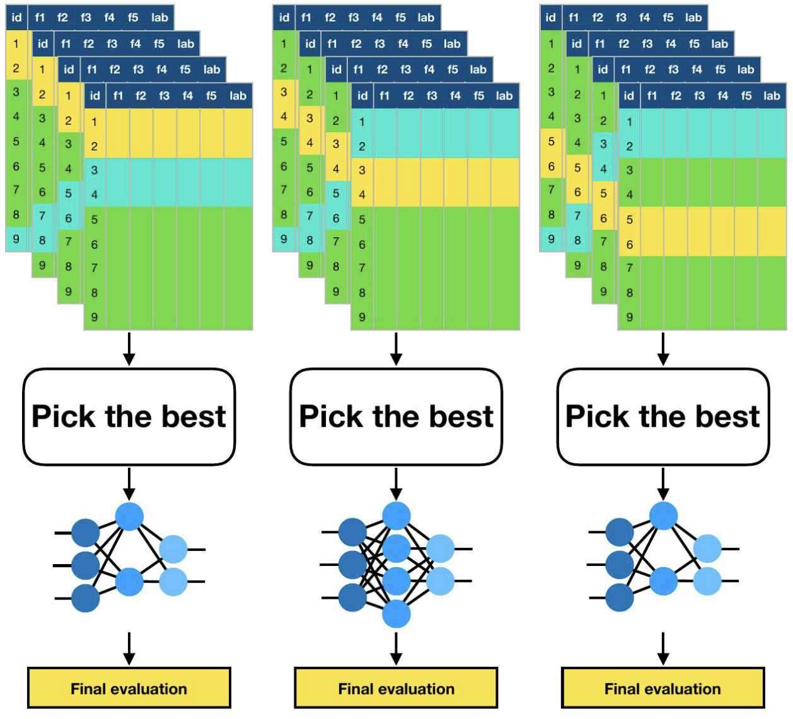

在每个交叉验证步骤中，分离 1 个折叠进行测试。
● 对剩余的 k-1 个折叠运行内部交叉验证，以找到最佳超参数。
● 每个折叠仍将具有不同的超参数，只是根据更多数据进行选择。

#### In Production

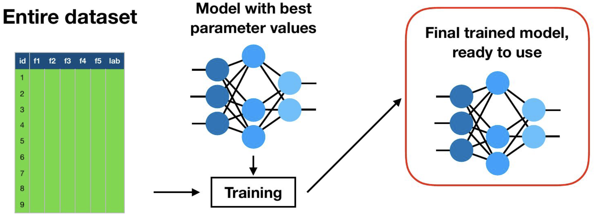

当我们完成所有实验并知道最佳超参数值时，我们可以对整个数据集进行重新训练。
**优点：**可以使用所有可用数据来训练模型。
**缺点：**我们再也没有办法评估最终训练模型的性能了。

### Summary

Case 1: 当有充足的数据时 ->  Hold-out 法

1. 在训练集上训练算法
2. 在验证集上调整超参数
3. 使用测试集来估计泛化性能

Case 2: 当数据量有限时 -> Cross-validation

1. 将数据集分成k折
2. 用1折作为测试集，其余k-1折用于训练和验证
3. 重复k次，每次选择不同的折作为测试集
4. 通过对所有测试折的结果取平均值来估计泛化性能

这两种方法都是为了评估模型在未见过的数据上的表现能力(泛化性能),选择哪种方法主要取决于可用数据量的多少。案例1适用于数据充足的情况,而案例2则是在数据有限时的替代方案。

## Metrics

$$
\begin{align*}
\text{Accuracy} &= \frac{TP+TN}{TP+TN+FP+FN}\\
\text{Precision} &= \frac{TP}{TP+FP}\\
&= P(\text{+ samples} \mid \text{samples classified as +})\\
\text{Recall} &= \frac{TP}{TP+FN}\\
&= P(\text{corrected classfied} \mid \text{+ samples})\\
F_1 &= \frac{2 \cdot \text{Precision}\cdot \text{Recall}}{\text{Precision}+ \text{Recall}}\\
F_\beta &= (1+\beta^2)\cdot\frac{\text{Precision}\cdot \text{Recall}}{(\beta^2\cdot\text{Precision})+ \text{Recall}}\\
\end{align*}
$$
High Precision：标记为正的样本确实是正的（FP 数量较少）
High Recall：类别被正确识别（FN 数量较少）

High Recall, Low Precision：大多数正例被正确识别（低 FN），但有很多假阳性
Low Recall, High Precision：我们错过了很多正例（高 FN），但我们预测为正例的那些确实是正例（低 FP）

### Confusion Matrix

CFM 是多酚类情况的描述

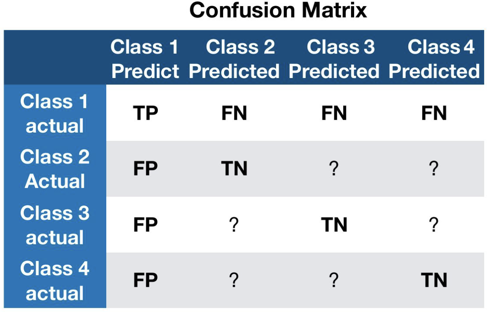

## Overfitting

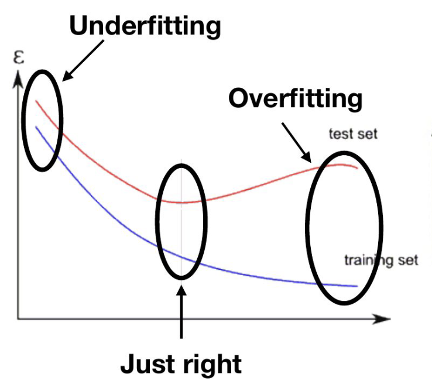

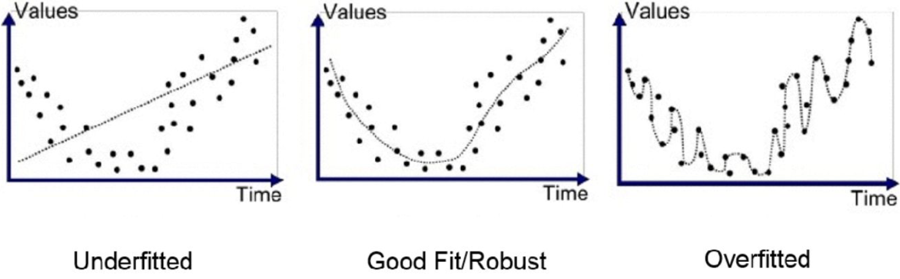

- 我们使用的模型太复杂
- 训练集中的示例不能代表所有可能的情况
- 学习时间太长（例如在神经网络中）

我们可以通过以下方式对抗过度拟合：
● 使用正确的复杂度（使用验证集来决定）。
● 获取更多数据。
● 尽早停止训练（使用验证集来了解何时停止）。

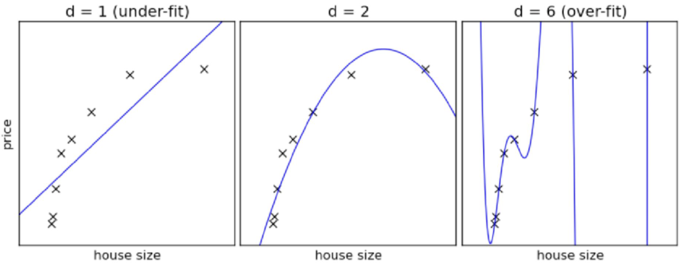

## Confidence Intervals

测试集中使用的数据量也会影响我们对性能评估的信心
$$
\begin{align}
\text{True Error} &= P[f(x) \neq h(x)]
\\
\text{Sample Error}(h) &= \frac{1}{| S|}\sum_{s \in S}\mathbb{I}[f(x) \neq h(x)]
\\
\text{Error}_S(h) &= \frac{1}{| S|}\sum_{s \in S}\mathbb{I}[f(x) \neq h(x)]
\end{align}
$$

考虑测试集有 $n = |S|$ 个 Sample，如 $N \geq 30$，其置信度为 $N\%$ 的区间被定义为
$$
\text{Error}_S(h)\pm Z_N\sqrt{\frac{\text{Error}_S(h)\cdot(1-\text{Error}_S(h))}{n}}
$$

|  N%   | 50%  | 68%  | 80%  | 90%  | 95%  | 98%  | 99%  |
| :---: | :--: | :--: | :--: | :--: | :--: | :--: | :--: |
| $Z_N$ | 0.67 | 1.00 | 1.28 | 1.64 | 1.96 | 2.33 | 2.58 |

其区间为 $[下界, 上界]$

> **Example**
>
> 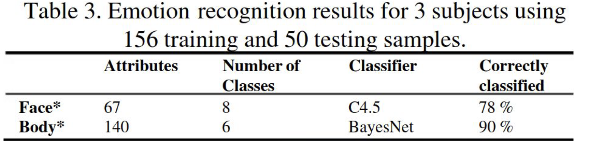
>
> 给定 $error_s(h)=0.22, n=50, Z_N=1.96$ for $N=95%$
> $$
> \left[0.22 - 1.96\sqrt{\frac{0.22(1-0.22)}{50}}, 0.22 + 1.96\sqrt{\frac{0.22(1-0.22)}{50}}\right] = [0.11,0.33]
> $$

## Statistical Significant

### Motivation

在机器学习中，我们需要确定观察到的结果是真实存在的模式，而不是随机产生的
统计显著性测试可以帮助我们量化这种判断的可靠程度
例如：如果模型A比模型B的准确率高1%，我们需要知道这是真实的提升还是随机波动

当我们进行大量实验和比较时，仅凭直觉很容易得出错误的结论
统计显著性检验提供了一个客观的标准
通常使用p值<0.05作为判断标准，这意味着随机产生这种结果的概率小于5%
显著性检验即用于实验处理组与对照组或两种不同处理的效应之间是否有差异，以及这种差异是否显著的方法。

### Approaches

考虑通过交叉验证得出的两个不同分类器的分类误差分布。
仅凭分布的平均值不足以说明哪个分类器更好。 在所有情况下,平均差异都是相同的。
这就是为什么我们需要运行统计测试来判断这两个分布之间是否确实存在差异。

统计检验可以告诉我们两组数据的均值是否具有显著差异。

有几种统计检验方法：Randomisation、T-test、Wilcoxon rank-sum 等。

- Randomisation test：随机交换两个模型的部分预测结果，测量新的性能差异大于或等于原始差异的频率。
- Two-sample T-test：估计来自不同总体的两个指标（如分类错误率）是否确实存在差异。
- Paired T-test：用于评估配对结果的显著性，例如在交叉验证的相同折叠上的分类错误率。

Null Hypothesis：假设两种算法/模型的性能相同，观察到的性能差异仅仅是由抽样误差造成的。
统计检验会返回一个p值：在零假设成立的前提下，获得观察到的性能差异（或更大差异）的概率。
较小的p值 -> 我们可以更有把握地认为一个系统确实与另一个系统存在差异。

当 $p<0.05$ 时，性能差异被认为是具有统计显著性的。
$p>0.05$ 并不意味着两种算法是相似的。这仅仅表明我们无法观察到统计差异。
例如，收集更多的数据可能会使p值向任一方向改变。

### Error Types

常把一个要检验的假设记作 $H_0$ 称为 Null Hypothesis，与 $H_0$  对立的假设记作 $H_1$，称为 Alternative Hypothesis。

1. 在 $H_0$ 为真时，决定放弃 $H_0$，称为 Type I  Error，其出现的概率通常记作 $\alpha$
2. 在 $H_0$ 不真时，决定接受 $H_0$，称为 Type II Error，其出现的概率通常记作 $\beta$

通常只限定犯 T1E 的最大概率 $\alpha$， 不考虑犯 T2E 的概率  $\beta$。这样的假设检验又称为显著性检验，概率 $\alpha$称为[显著性水平](http://wiki.mbalib.com/wiki/显著性水平)。

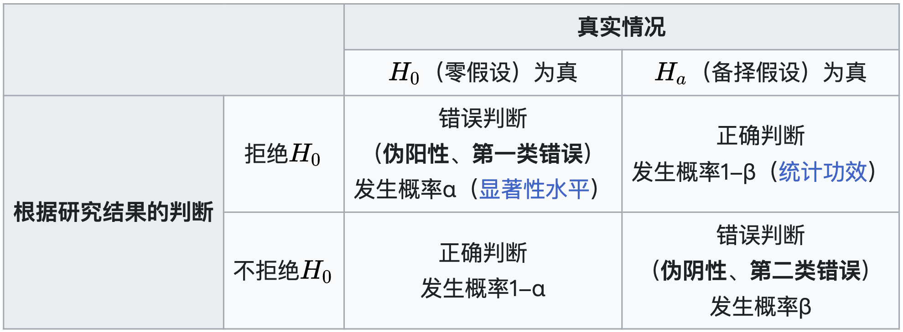

### p-Value

p值是在假设 $H_0$ 为真的情况下，观察到当前或更极端结果的概率。

用更通俗的语言解释：

1. 假设"没有真实差异"(这就是零假设)
2. 计算在这个假设下，看到当前或更极端数据的概率
3. 这个概率就是p值

> **场景设定：**
>
> - 你抛了10次硬币
> - 得到了8次正面，2次反面
> - 你怀疑这个硬币是否公平
>
> **分析过程：**
>
> - 零假设($H_0$)：硬币是公平的(正面概率=0.5)
> - 在这个假设下，得到8次或更多正面的概率是多少？
> - 这个概率就是p值

### Model Comparison

比较不同模型性能时，使用t检验或其他统计检验来确定性能差异是否显著

- $$H_0: \mu_1 = \mu_2$$ (零假设：两个模型性能相同)
- $$H_1: \mu_1 \neq \mu_2$$ (备择假设：两个模型性能不同)

### P Hacking / P 值操纵

P值操纵是指滥用数据分析方法，将实际上没有潜在效应的数据呈现为具有统计显著性的模式。
这种操纵通过运行大量实验并只关注那些返回显著结果的实验来完成。

统计显著性被定义为结果由随机性导致的可能性小于5%（p < 0.05）。
这意味着我们必须接受某些"显著"的结果实际上将是假阳性！

这部分内容主要警示了在统计分析中可能出现的一种不当行为：通过反复尝试或选择性报告来制造统计显著性。这种做法会导致错误的研究结论，因为即使在原假设为真的情况下，也会有一定比例的检验结果呈现显著性。

每个方格代表一个可能的实验。假设我们有 800 种不同的实验可以尝试。

真实的基本分布：100 次实验为正，700 次实验为负

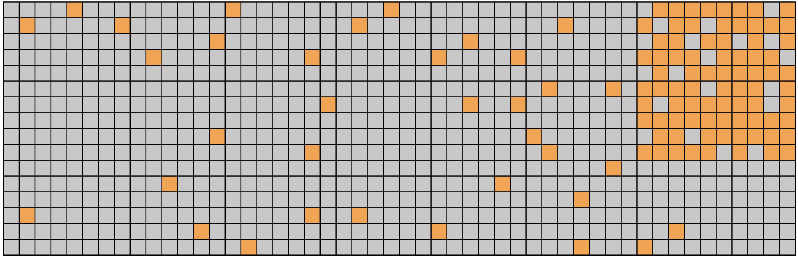

在我们的数据样本中，我们要么得到  
           阳性结果 OR 阴性结果
P(false positive) = 0.05 P(false negative) = 0.2

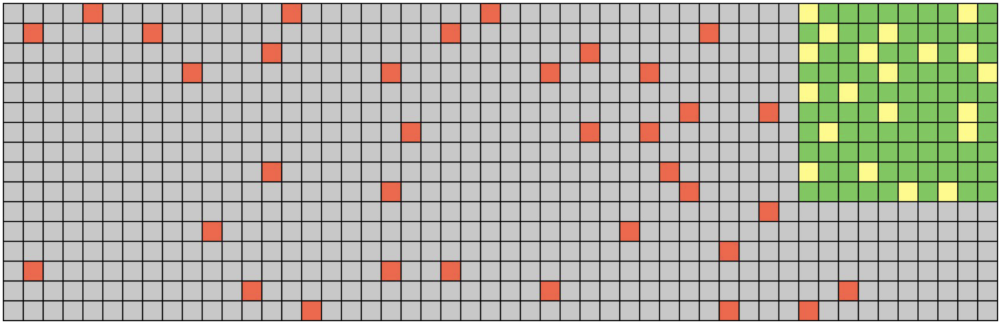

绿色：我们有 80 项真正的发现 (TP)
黄色：我们错过了 20 个潜在发现 (FN)
红色：我们有 35 个错误发现 (FP)
错误发现比例 = 35 / 115 = 30%

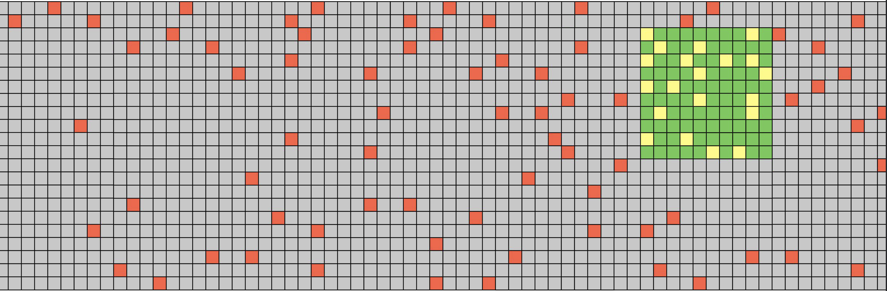

如果我们在 2400 多次实验中这样做：
绿色：我们有 80 项真正的发现
红色：我们有 115 个错误发现
错误发现比例 = 80 / 195 = 59%

### Against

区分验证假设和探索数据。Benjamini & Hochberg (1995)提出了一个自适应p值方法：

1. 对 $M$ 个实验的p值进行排序。$p_1 \leq p_2 \leq p_3 \leq ... \leq p_M$
2. 为每个实验计算Benjamini-Hochberg临界值。$z_i = 0.05\frac{i}{M}$
3. 显著性结果是p值小于临界值的实验。

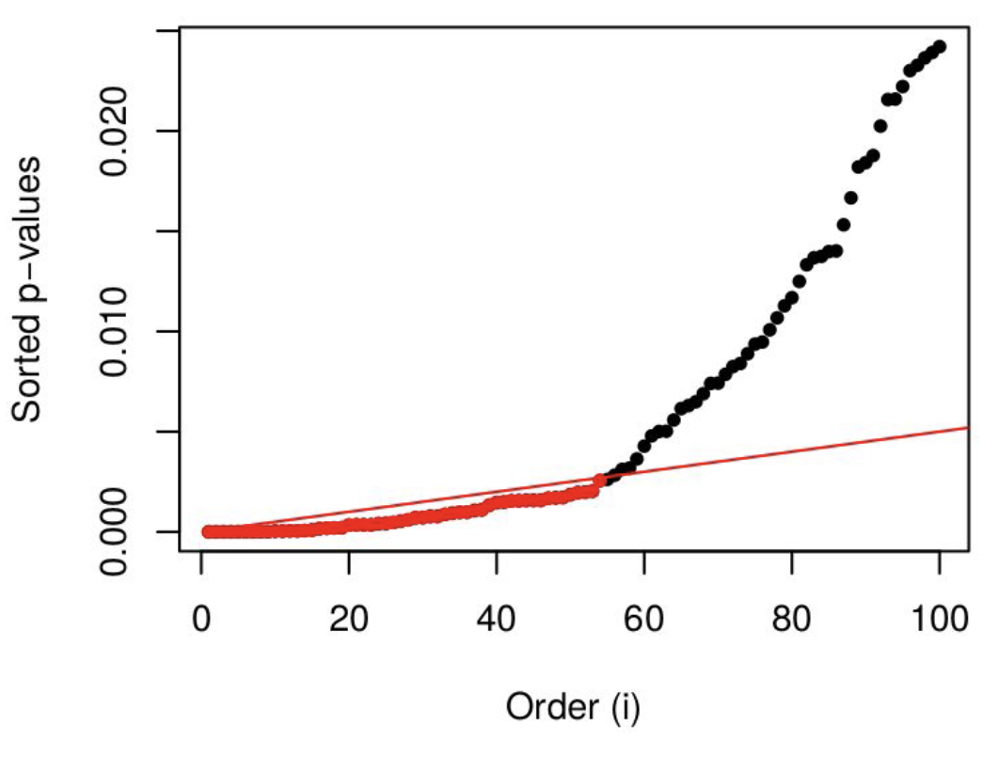

排序后的p值分布图，其中：

- 纵轴是排序后的p值
- 横轴是序号(i)
- 黑点表示实际p值
- 红线表示临界值线
- p值低于红线的实验结果被认为具有统计显著性

这种方法有助于控制多重检验中的假阳性发现率(FDR)，是一种应对p-hacking的重要统计工
