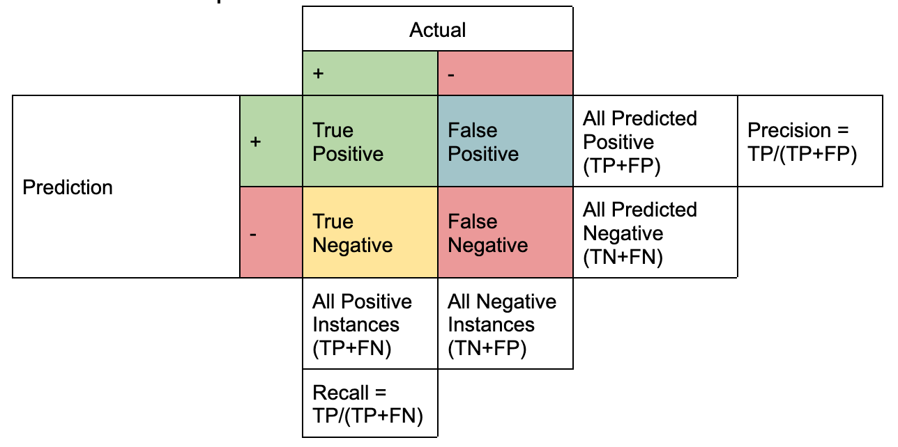

# Lecture 3: Evaluation

[TOC]

## Hold-out 法

### Hyperparameter Tuning

**Hyperparameter:** 训练前选择的参数（kNN中的k）

**Overall Objective：**寻找拥有最好性能的 Hyperparameter

**Motivation：**寻找在未知数据上最好的 Hyperparameter（泛化性能）

#### 不同的 Approach

**最原始的 Approach：**

- 在训练数据集上尝试不同的值，然后根据训练数据集的准确性选择最佳值（然后在测试数据集上进行评估 (然后在测试数据集上进行评估）
- **问题： 通常不能很好地泛化**

**错误的方法：**

- 在训练数据集上尝试不同的值，然后根据测试数据集的准确性选择最佳值。
- **问题：** 测试数据集现在是你训练过程的一部分（因为你根据它做出了决定），因此我们无法评估你的算法如何推广到未知数据。

**正确的方法：**

- 将数据集分为三部分：**Training/Validation/Test**
- 在 60%/20%/20% 和 80%/10%/10% 之间进行常见分割
- 在训练数据集上尝试不同的 Hyperparameter，然后根据验证数据集上的准确率选择最佳值。在测试数据集上进行最终评估。
- **优点：**超参数的选择考虑到了模型的泛化方式，而且最终评估仍然只使用以前未见过的数据。

保留在验证集上产生最大性能的分类器（本例中为使用 35 个隐藏神经元训练的分类器）。
这叫做hyperparameter tuning/optimization，因为你选择的参数集产生了最好的分类器

在寻找到最好模型的超参数，你可以使用该训练的模型或者合并 Validation 和 Train训练一个新模型。最终的 Evaluation 永远在测试集。

## Cross-validation

当我们有大量示例时，将其划分为训练/验证/测试数据集就足够了。
当我们只有少量可用数据集时，一个好的替代方法是交叉验证。

将数据集分成 k 个（通常为 10 个）相等的折叠/分割。使用 k-1 个折叠进行训练+验证，一个折叠进行测试。
● 迭代 k 次，每次测试数据的不同部分。
● 然后可以对所有 k 个保留测试集的性能进行平均
$$
\text{Global Error Estimate} = \frac{1}{N} \sum_{i=1}^N e_i
$$

### Hyperparamter Tuning

#### Approach 1

如果我们需要 estimate 超参数，则需要划分 Validation Set

- 每次迭代使用 1 fold 进行测试，1 fold进行验证，k-2 fold 进行训练。
- 每当我们使用多个训练集时，我们都在评估算法，而不是特定模型。
- 我们在每个 fold 中找到一组不同的最佳参数。

#### Approach 2: Nested k-Fold

在每个交叉验证步骤中，分离 1 个折叠进行测试。
● 对剩余的 k-1 个折叠运行内部交叉验证，以找到最佳超参数。
● 每个折叠仍将具有不同的超参数，只是根据更多数据进行选择。

#### In Production

当我们完成所有实验并知道最佳超参数值时，我们可以对整个数据集进行重新训练。
**优点：**可以使用所有可用数据来训练模型。
**缺点：**我们再也没有办法评估最终训练模型的性能了。

### Summary

Case 1: 当有充足的数据时 ->  Hold-out 法

1. 在训练集上训练算法
2. 在验证集上调整超参数
3. 使用测试集来估计泛化性能

Case 2: 当数据量有限时 -> Cross-validation

1. 将数据集分成k折
2. 用1折作为测试集，其余k-1折用于训练和验证
3. 重复k次，每次选择不同的折作为测试集
4. 通过对所有测试折的结果取平均值来估计泛化性能

这两种方法都是为了评估模型在未见过的数据上的表现能力(泛化性能),选择哪种方法主要取决于可用数据量的多少。案例1适用于数据充足的情况,而案例2则是在数据有限时的替代方案。

## Metrics

$$
\begin{align*}
\text{Accuracy} &= \frac{TP+TN}{TP+TN+FP+FN}\\
\text{Precision} &= \frac{TP}{TP+FP}\\
&= P(\text{+ samples} \mid \text{samples classified as +})\\
\text{Recall} &= \frac{TP}{TP+FN}\\
&= P(\text{corrected classfied} \mid \text{+ samples})\\
F_1 &= \frac{2 \cdot \text{Precision}\cdot \text{Recall}}{\text{Precision}+ \text{Recall}}\\
F_\beta &= (1+\beta^2)\cdot\frac{\text{Precision}\cdot \text{Recall}}{(\beta^2\cdot\text{Precision})+ \text{Recall}}\\
\end{align*}
$$
High Precision：标记为正的样本确实是正的（FP 数量较少）
High Recall：类别被正确识别（FN 数量较少）

High Recall, Low Precision：大多数正例被正确识别（低 FN），但有很多假阳性
Low Recall, High Precision：我们错过了很多正例（高 FN），但我们预测为正例的那些确实是正例（低 FP）

### Confusion Matrix

CFM 是多酚类情况的描述

## Overfitting

- 我们使用的模型太复杂
- 训练集中的示例不能代表所有可能的情况
- 学习时间太长（例如在神经网络中）

我们可以通过以下方式对抗过度拟合：
● 使用正确的复杂度（使用验证集来决定）。
● 获取更多数据。
● 尽早停止训练（使用验证集来了解何时停止）。

