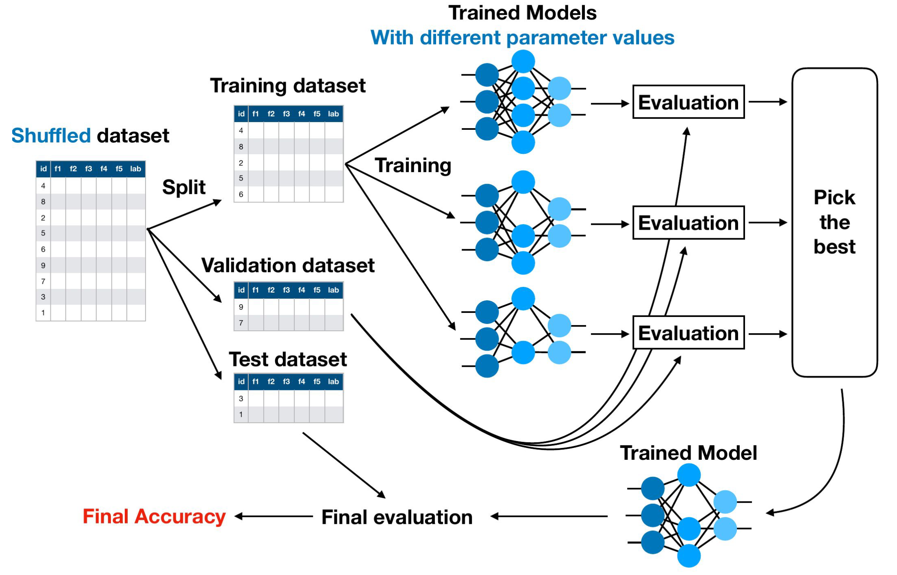

# Lecture 3: Evaluation

## Hyperparameter Tuning

**Hyperparameter:** 训练前选择的参数（kNN中的k）

**Overall Objective：**寻找拥有最好性能的 Hyperparameter

**Motivation：**寻找在未知数据上最好的 Hyperparameter（泛化性能）

### 不同的 Approach

最原始的 Approach：

- 在训练数据集上尝试不同的值，然后根据训练数据集的准确性选择最佳值（然后在测试数据集上进行评估 (然后在测试数据集上进行评估）
- **问题： 通常不能很好地泛化**

**错误的方法：**

- 在训练数据集上尝试不同的值，然后根据测试数据集的准确性选择最佳值。
- **问题：** 测试数据集现在是你训练过程的一部分（因为你根据它做出了决定），因此我们无法评估你的算法如何推广到未知数据。

**正确的方法：**

- 将数据集分为三部分：**Training/Validation/Test**
- 在 60%/20%/20% 和 80%/10%/10% 之间进行常见分割
- 在训练数据集上尝试不同的 Hyperparameter，然后根据验证数据集上的准确率选择最佳值。在测试数据集上进行最终评估。
- **优点：**超参数的选择考虑到了模型的泛化方式，而且最终评估仍然只使用以前未见过的数据。

保留在验证集上产生最大性能的分类器（本例中为使用 35 个隐藏神经元训练的分类器）。
这叫做hyperparameter  tuning/optimization，因为你选择的参数集产生了最好的分类器