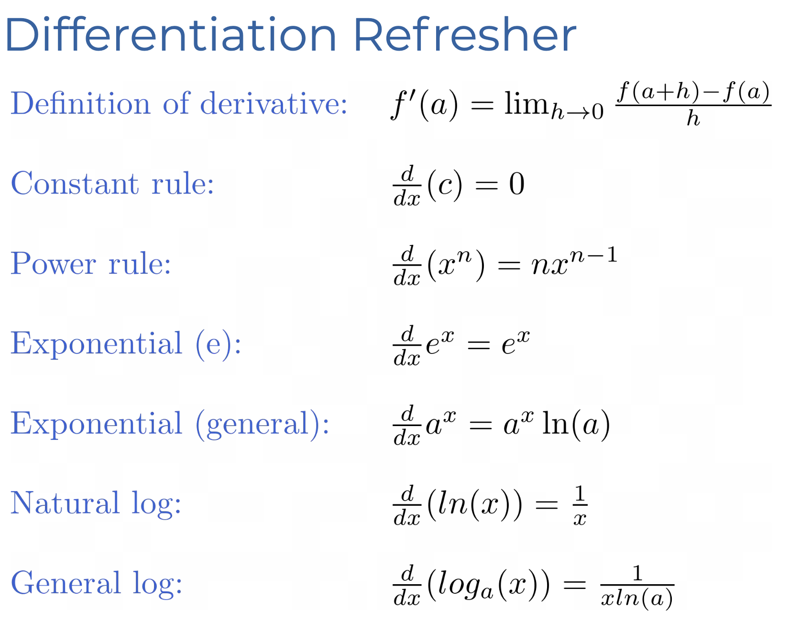
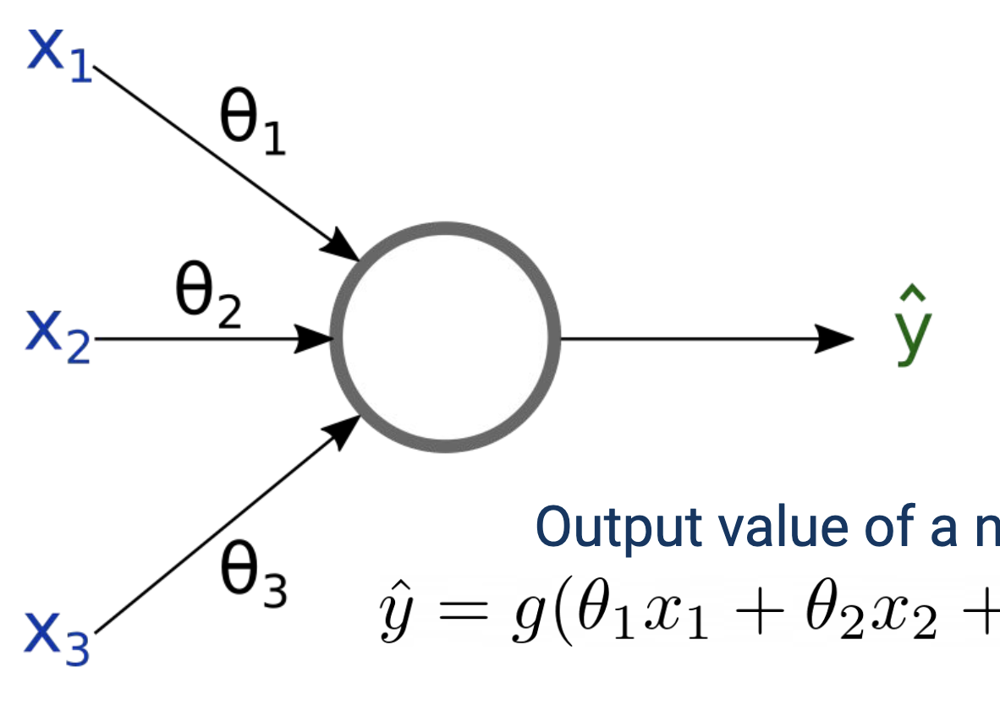
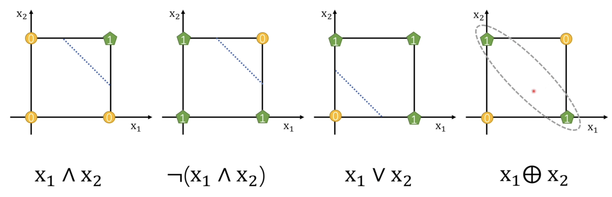
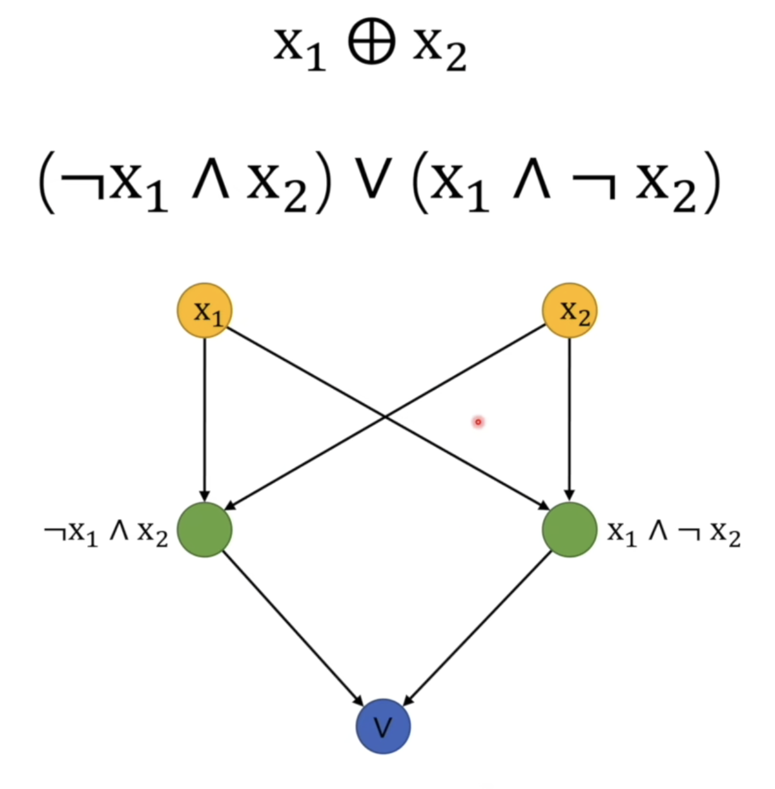

# Lecture 4: NN Part I

$$
\begin{align}
\text{Given }
\mathcal{D} &= \{
\lang x^{(1)}, y^{(1)}\rang,\lang x^{(2)}, y^{(2)}\rang,\cdots, \lang x^{(N)}, y^{(N)}\rang
\}\\
\text{Goal } f:&X\to Y
\\
\text{such that } & \forall i = 1,2,3,\dots, N. y^{(i)} = f(x^{(i)})

\end{align}
$$

## Linear Regression

$$
\begin{align}
E&=\frac{1}{2}\sum^N_{i=1}\left(\hat{y}^{(i)} - y^{(i)} \right)^2\\
&=\frac{1}{2}\sum^N_{i=1}\left(\mathbf{w}^T{x}^{(i)}+b - y^{(i)} \right)^2
\\
\frac{\part E}{\part \mathbf{w}} &=\frac{\part }{\part \mathbf{w}}\frac{1}{2}\sum^N_{i=1}\left(\mathbf{w}^T{x}^{(i)}+b - y^{(i)} \right)^2
\\
&= \frac{1}{2}\sum^N_{i=1}\frac{\part }{\part \mathbf{w}}\left(\mathbf{w}^T{x}^{(i)}+b - y^{(i)} \right)^2
\\
&= \sum^N_{i=1}\left(\mathbf{w}^T{x}^{(i)}+b - y^{(i)} \right)x^{(i)}
\\
&= \sum^N_{i=1}\left(\hat{y}^{(i)}- y^{(i)} \right)x^{(i)}
\\
\frac{\part E}{\part  b} &=\sum^N_{i=1}\left(\hat{y}^{(i)}- y^{(i)} \right)
\end{align}
$$

$$
\text{GD: } a' := a - \alpha\nabla E_a
$$
Analytical Solution for Linear Regression
$$
\nabla_\theta E(\theta) = X^T(X\theta - y) = 0 \Longrightarrow\theta^* = (X^TX)^{-1}X^Ty
$$

## Neuron

$$
\hat{y} = g(\Theta^Tx + b)
$$
$g$：激活函数
$\Theta$: 权重向量
$x$: 输入参数

即
$$
\hat{y} = g(W^Tx + b)\\
W\in \mathbb{R}^{K\times 1}\quad x \in \mathbb{R}^{K\times 1} \quad \hat{y}\in \mathbb{R}^{1\times 1}
$$
Logistic function:
$$
g(z) = \frac{1}{1+e^{-z}}\\
z\in \mathbb{R} \quad g(\cdot) \in[0, 1]
$$
Liogistic Regression
$$
\hat{y} = g(W^Tx) = g\left(\sum_k\theta_k x_k\right)
$$
Perceptron 使用 Thrreshold Function 作为激活函数
$$
h(x) = f(W^Tx) = \begin{cases}
1 & \text{if } W^Tx > 0\\
0 & \text{otherwise}
\end{cases}
$$
其更新规则为：
$$
\theta_i = \theta_i + \alpha(y-h(x))x_i
$$

> **Mathematics behind Perceptron GD**
> $$
> \begin{align}
> L(\theta) &= \frac{1}{2}(y-h(x))^2
> \\
> \nabla L(\theta) &=\frac{\part}{\part \theta}\frac{1}{2}(y-h(x))^2
> \\
> &=\frac{\part \frac{1}{2}(y-h(x))^2}{\part h(x)}\frac{\part h(x)}{\part \theta}
> \\
> &=-(y-h(x))\frac{\part h(x)}{\part \theta}
> \\
> &=-(y-h(x))x
> \\
> \theta &\leftarrow\theta - \alpha\nabla L
> \\
> &\leftarrow\theta + \alpha(y-h(x))x
> \end{align}
> $$

需要注意，Perception 无法完整处理 XOR，但是可以处理 AND OR 和 NAND

可以将 XOR 拆分

