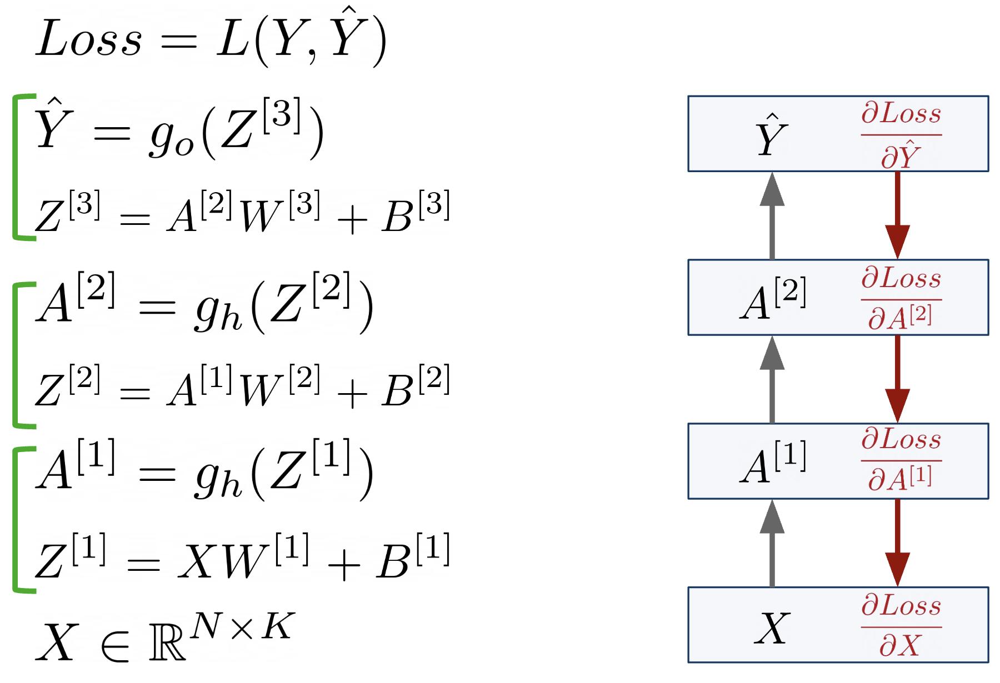
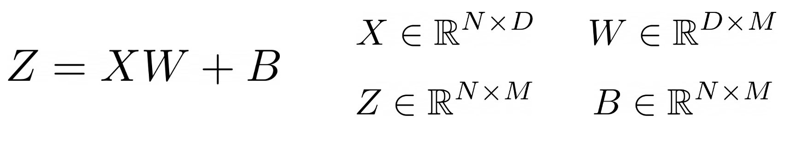
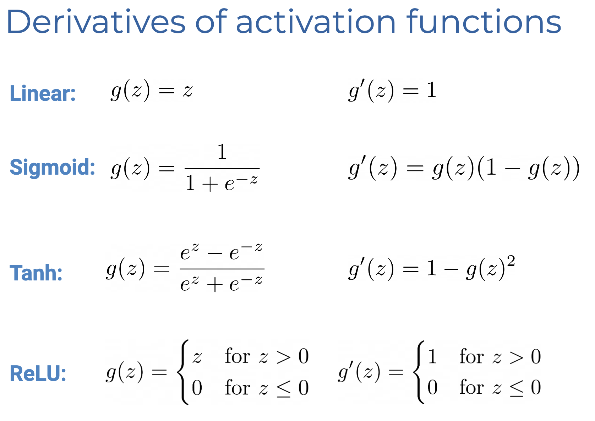
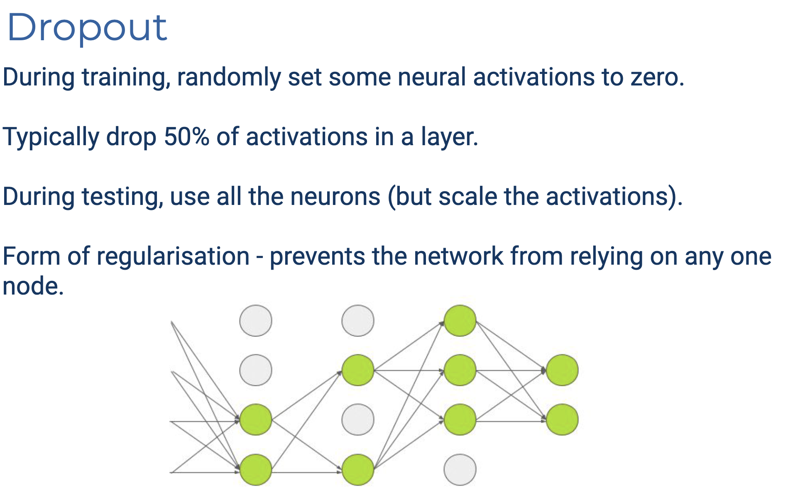

# Week 6: NN Part II

## Optimisation

定义损失函数 $E$，则优化过程可以写作
$$
\theta_{t+1} = \theta_t - \alpha\nabla E_{\theta_t}
$$
MSE (Regression)
$$
MSE=\frac{1}{N}\sum^N_{i=1}(\hat{y}_i - y)^2
$$
Cross-Entropy (Classification)

Maximise Likelihood
$$
\max \prod^N_{i=1}p(y^{(i)} \mid x^{(i)}; \theta)
$$
这里的假设是不同的sample 是 i.i.d.的：$p(A\and B) = p(A)p(B)$

对于 Binary Classification 来说，可以使用 Bernoulli Dist.
$$
\begin{align}
&\max \prod^N_{i=1}(\hat{y}^{(i)})^{y^{(i)}}(1-\hat{y}^{(i)})^{1-y^{(i)}}
\\
=&\max \sum^N_{i=1} [
y^{(i)}\ln{\hat{y}^{(i)}}+(1-y^{(i)})\ln({1-\hat{y}^{(i)})}
]
\\
\equiv &\min -\frac{1}{N}\sum^N_{i=1}[
y^{(i)}\ln{\hat{y}^{(i)}}+(1-y^{(i)})\ln({1-\hat{y}^{(i)})}
] \quad\text{(Binary CE)}
\\
\equiv &\min -\frac{1}{N}\sum^N_{i=1}\sum^C_{c=1}[
y_c^{(i)}\ln{\hat{y}_c^{(i)}}] \qquad\qquad\qquad\qquad\quad \text{(Categorical CE)}

\end{align}
$$

## Backpropagation

### Linear

$$
X_{\text{n\_sample}\times \text{n\_feature}}\quad
B_{\text{n\_sample}\times \text{1}}\quad
W_{\text{n\_feature}\times \text{n\_out}}\quad
Y_{\text{n\_sample} \times 1}\quad
L_{\text{n\_out}\times \text{1}}

\\
Y = XW + B

\\
\frac{\part L}{\part X}_{\text{n\_sample} \times\text{n\_feature}}
\quad
\frac{\part L}{\part Y}_{\text{n\_sample} \times\text{n\_out}}
\quad
\frac{\part L}{\part W}_{\text{n\_feature}\times \text{n\_out}}
\\
\frac{\part L}{\part X} = \frac{\part{L}}{\part Y} \frac{\part Y}{\part X} = \frac{\part L}{\part Y}W^T
\\\frac{\part L}{\part W} = \frac{\part{L}}{\part Y}\frac{\part{Y}}{\part W} = X^T\frac{\part{L}}{\part Y}
\\\frac{\part L}{\part B} = \frac{\part{L}}{\part B}\frac{\part{Y}}{\part W} = \mathbf{1}^T\frac{\part{L}}{\part Y}
$$

## Adaptive GD LR

LR Decay $\alpha \leftarrow \alpha d \quad d\in[0, 1]$

## Weight Initialisation

1. Zeros
2. Normal Distribution
3. Xavier Distribution

在机器学习中，不同的随机初始化会导致不同的结果。看似简单的解决方案是设置固定的随机种子，但这还不够。

更深层的问题：

- GPU并行计算时，线程的完成顺序是随机的
- 浮点数计算中的微小舍入误差会逐渐累积
- 这些因素会影响部分（不是全部）运算结果

最佳解决方案：与其试图消除随机性，不如接受它，并：

- 使用不同的随机种子进行多次实验
- 取多次实验的平均值作为最终结果

## Normalisation

Min-Max Normalisation: 假设 Scale 到 $[a, b]$
$$
X' = a + \frac{(X - X_\text{min})(b-a)}{X_\text{max} - X_\text{min}}
$$
Standarisation (z-normalisation):
$$
X' = \frac{X - \mu}{\sigma}
$$

## Overfit & Underfit

