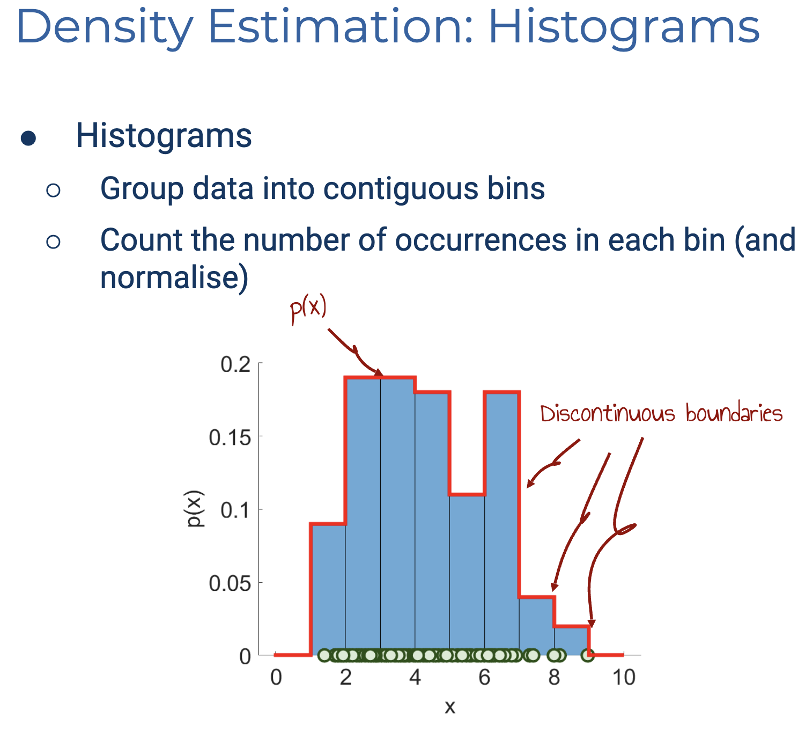
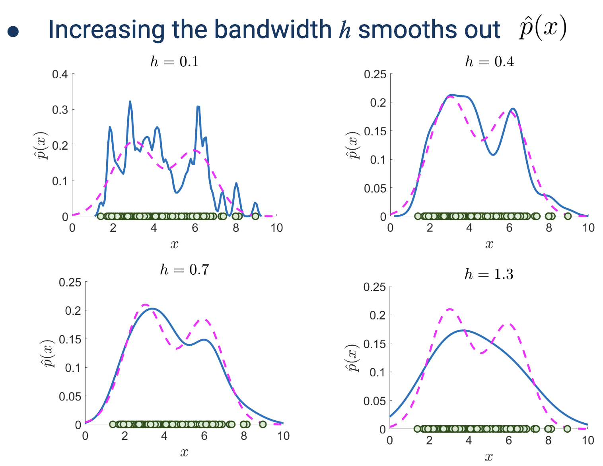
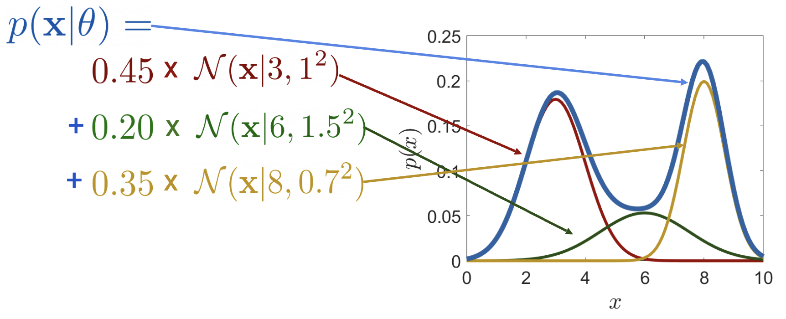

# Week 7: Unsupervised Learning

[TOC]

## k-Means

Elbow 可能回更倾向于 3

优势：

- 简单：易于理解和实现
- 流行：常用于 clustering
- 高效：线性复杂度。对于 $T$ 个迭代 $K$ 个cluster，$N$ 个样本，$O(KTN)$，因为 $K << T << N$，因此考虑为 $O(N)$

缺点：

- 需要超参数 k
- k-Means 寻找 local optimum
- 对初始 centroid 很敏感（通常选择 k 个 instance 以避免 empty clustering）

解决方案：

- 选择有最小损失的模型
- 选择更好的初始化方法：e.g. k-Means ++

缺点+

- 必须要有距离函数，对于categorical data 可以用 k-Mode，其centroid 表示更频繁的值

- 对 outlier 很敏感

- k-means 不适合发现不是超椭圆体hyper-ellipsoids（或超球体 hyper-spheres）的聚类。

  

## Probability Density Estimation

**异常检测或新奇检测**

生成模型（Generative Model）:

1. 目标: 学习数据的联合概率分布 P(X,Y)，即尝试理解"数据是如何产生的"
2. 特点:

- 可以生成新的数据样本
- 学习到的是数据的完整概率分布
- 通过贝叶斯定理可以得到 P(Y|X)
- 典型算例:
  - 朴素贝叶斯(Naive Bayes)
  - 隐马尔可夫模型(HMM)
  - 生成对抗网络(GAN)
  - 变分自编码器(VAE)

判别模型（Discriminative Model）:

1. 目标: 直接学习条件概率分布 P(Y|X)，即关注"如何区分不同类别"
2. 特点:

- 直接对分类边界建模
- 预测准确率通常比生成模型高
- 不能生成新样本
- 典型算例:
  - 逻辑回归(Logistic Regression)
  - 支持向量机(SVM)
  - 决策树(Decision Tree)
  - 传统神经网络

## PDE: Non Parametric

|  |  |
| -- | -- |

### Kernel Density Estimation

核密度估计是一种非参数的密度估计方法，它通过观察数据点来估计概率密度函数。
$$
\hat{p}(x) = \frac{1}{N}\sum_{i=1}^N \frac{1}{h^D}H\left(\frac{x-x^{(i)}}{h}\right)
$$

- $h$: 带宽(bandwidth)或窗口大小，控制平滑程度
- $D$: 数据的维度数
- $N$: 样本数量
- $x(i)$: 第i个训练样本点

$\frac{1}{h^D}$ 是窗口体积的归一化项

核函数(Kernel Function)：

- 在这个例子中使用的是 Parzen 窗口
- 当数据点落在窗口内（距离小于 1/2）时，H(u)=1；否则 H(u)=0
- 这相当于在每个数据点周围创建一个"窗口"或"核"

$$
H(u) = \begin{cases}
1 & |u_j| < \frac{1}{2}; j=1,\ldots,D \\
0 & \text{otherwise}
\end{cases}
$$

5. 实际应用：
- 较大的h值会使曲线更平滑，但可能丢失细节
- 较小的h值会保留更多细节，但可能过拟合
- 需要根据实际情况选择合适的带宽h

这种方法的优点是：
- 不需要预设分布形式
- 直接从数据中学习分布
- 可以捕捉到复杂的多峰分布

缺点是：
- 计算复杂度随样本量增加而增加
- 带宽h的选择比较关键
- 在高维数据上可能效果不好（维度诅咒）

将核函数改为高斯函数，则：使用了指数函数 exp(...)

添加了归一化常数 (2πh²)^(D/2)

## PDE: Parametric Method

我们可以用混合模型（Mixture Model）去组合达到 trade off

## GMM-EM

GMM: Weighted mixture of Gaussians

GMM 可以模拟复杂的数据分布但有更多参数需要优化！
无法最大化似然。每个参数的更新都依赖 其他参数。

### EM 算法

#### Step 1: Initialise

选择 $K$，随机初始化参数
$$
\theta = \{
\pi_k, \mu_k : k = 1, \dots, K
\}
\qquad
\sum_{k=1}^K \pi_k = 1 \quad \pi_k \in [0, 1]
$$

#### Step 2: E-step

计算每个训练样本 $x^{(i)}$ 和每个混合成分 k 的响应度(responsibilities)

响应度计算公式：
$$
r_{ik} = \frac{\pi_k\mathcal{N}(\mathbf{x}^{(i)}\mid\mu_k, \Sigma_k)}{\sum_{j=1}^K \pi_j\mathcal{N}(\mathbf{x}^{(i)}\mid\mu_j, \Sigma_j)}
$$

其中：
- $r_{ik}$ 是第$i$个样本属于第$k$个组件的响应度
- $\pi_k$ 是混合权重
- $\mathcal{N}$ 表示正态分布
- $\mu_k$ 和 $\Sigma_k$ 分别是第 $k$ 个组件的均值和协方差矩阵

- 不同颜色的点表示不同的聚类
- 椭圆表示高斯分布的轮廓
- 图中标注"Notice the dot colour changed"(注意点的颜色发生变化)说明这是算法迭代过程中样本所属类别的变化

#### Step 3: M-step

更新所有 Mixture component 的中心
$$
\hat\mu_k = \frac{1}{N_k}\sum^N_{i = 1}r_{ik}\mathbf{x}^{(i)} \qquad N_k= \sum^N_{i=1}r_{ik}
$$

Location changed.

并更新 covariance
$$
\hat\Sigma_k=\frac{1}{N_k}\sum^N_{i = 1}r_{ik}\left(\mathbf{x}^{(i)} - \hat\mu_k\right)\left(\mathbf{x}^{(i)} - \hat\mu_k\right)^T \qquad N_k= \sum^N_{i=1}r_{ik}
$$

Shape changed

最后更新mixing proportion:
$$
\pi_k = \frac{N_k}{N}
$$

Height changed

#### Step 4: Convergence check 

参数无显著变化 或 Likelihood 停滞（stagnation）

需要注意，EM converges to local optimum

### Summary

### Hyperparameter Tuning

或者 k Fold CV

### Compare to k-Means

**We often initialise the means of GMM-EM from the result of K-means**

GMM-EM ="软K-means聚类"

**Hard clustering 硬聚类(k-means)**：每个数据点严格属于一个聚类

**Soft clustering 软聚类(GMM)**：每个数据点以不同程度属于多个聚类

- 每个  mixture component 代表一个不同的 clustering（其中 responsibilities $r_{ik}$定义了每个数据点属于各个聚类的概率）
- 到聚类中心（这里指 $\mu$）的距离不是 isotropic 各向同性的，会在学习过程中发生变化
  这个距离实际上与 Mahalanobis distance 相关

> 距离不是 isotropic: 不同方向上度量距离的方式可以不同
> 如果画出到中心点等距离的点的集合，会形成椭圆（2D）或椭球体（3D）
> 协方差矩阵允许算法在不同维度上有不同的"伸缩"程度

让我为您翻译这张对比K-means和GMM-EM算法的表格：

| K-means                                                      | GMM-EM                                                       |
| ------------------------------------------------------------ | ------------------------------------------------------------ |
| 目标函数：最小化平均平方距离                                 | 目标函数：最大化对数似然                                     |
| EM-like算法： - 分配步骤：将点分配给聚类 - 更新步骤：优化聚类参数 | EM算法： - E步骤：计算成员归属的后验概率 - M步骤：优化参数 |
| 在分配步骤中执行硬分配（Hard Assignment）                    | 在E步骤中执行软分配（Soft Assignment）                       |
| 假设球形聚类且每个聚类具有相等概率                           | 可用于non-pherical聚类，可以生成具有不同概率的聚类           |
