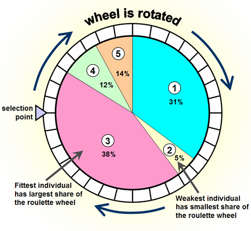

# Week 7: Evolution Algorithm

[TOC]

## Components

达尔文：适者生存；自然选择。
孟德尔：基因 杂交

Gene：DNA 中编码特定性状的核苷酸序列。
Genotype：Set of Genes
DNA = 支持基因型
Phenotype：Genotype 的生理表达

### 算法分类

**Evolutionary Strategies (ES)**
Evolutionary Programming: 有限状态机的进化
**Genetic Algorithms (GA):** 设计复杂和鲁棒的系统
**Genetic Programming (GP)**: 程序的进化

几乎都使用一个通用基础（common base）：

- 操纵 A population of solutions（最初是随机生成的）
- 每个solution 使用 genotype 表示
- Genotype 可以被开发为 phenotype
- 使用 fitness function 去确定 phenotypes 的性能（通常最大化 fitness function）
- fittest individuals 有更高概率传递其部分 genotype 给其 offspring（子代）

#### Genetic Opeators

**Selection Operator:** 选择会被 reproduce 的 solution
**Corss-over Operator 杂交:** 混合 parents 的 genotype
**Mutation Operator 突变:** 繁殖后 genotype 的变异类型和频率。

不同算法使用：

- 不同的 genotype 定义
- 使用不同的 Genetic Operator

|  | Genetic Algorithms                                           | Genetic Programming | Evolutionary Strategies |
| --- | ------------------------------------------------------------ | ------------------- | ----------------------- |
| Genotype | 定长的二进制字符串  e.g. 01001010 | 被表示为树的程序 通常是 LISP |float/double 字符串|
| Cross-over | 交换字符串的一部分 | 交换树的一部分 |通常不使用|
| Mutation | 随机bit flip | 更改树中的符号 |从高斯分布采样|

我们混合这些 Approach，统称其为 **Evolutionary Algorithms (EA)**

## Genetic Algorithms (GA)

### Example

考虑 Mastermind，每个棋子有 6 种颜色
$N$个颜色的秘密组合被 game master 定义 $N=4$，duplicates可能的
Goal：找到 Combination
Information：颜色正确位置正确的数量，颜色正确位置错误的数量

我们需要定义：Fitness Function，(Genotype, Phenotype), Selection Operator, Cross-over Operator, Mutation Operator, (Hyperparamaters, e.g., population size)

#### Fitness Function

**Role: 定义需要解释的问题**
Solving Problem = Max. Fitness

p1: 颜色正确位置正确的数量
p2: 颜色正确位置错误的数量
$$
F(x) = p_1 + 0.5 p_2
$$
我们知道这个函数的最大值 $\max F(x) = 4$

> 不同问题有不同 Fitness Function
>
> 对于机器人走路 F(x) = 走路速度 = 几秒走过的距离
> 对于机器人扔东西到目标 F(x) = - dist(object, target)

#### Genotypes & Phenotypes

**Role: 问题可能的解**

定义为 Binary String，如果有 $N$ 个隐藏棋子，每个棋子有 6 个状态，因此可以 3 bit 表达

**Genotype:** $N\times 3$ bit 的二进制字符串
**Phenotypes:** 每3个bit为一个int，每一个int表示不同颜色(0=red, 1=yellow) etc.

#### Selection Operator

**Role: 选择下一代的 parents**
##### 标准做法：Biased Roulette Wheel

每个个体都对应着圆盘上的一段区域。
具有 High fitness 的个体将获得更大的圆盘区域。
在圆盘上随机选取一个位置。
个体被选中的概率与其适应度成正比。

1. 计算从 population（种群）中选择个体的概率 $p_i$

2. 计算累积概率 Cumulative Prob

3. 随机生成一个在0到1之间的均匀分布随机数 $r$

4. 选择满足条件的个体 $x_i$

$$
p_i = \frac{f_i}{\sum_{j=1}^n f_j} \qquad
q_i = \sum_{j=1}^i p_j \qquad q_{i=1} < r \leq q_i
$$

1. 选择概率： $$p_i = \frac{f_i}{\sum_{j=1}^n f_j}$$
- $p_i$ 是第 $i$ 个个体被选中的概率
- $f_i$ 是第 $i$ 个个体的适应度值
- 分母是所有个体适应度之和
- 这确保了适应度越高的个体获得越大的选择概率

2. 累积概率：$$q_i = \sum_{j=1}^i p_j$$
- $q_i$ 是从第1个到第 $i$ 个个体的概率之和
- 它将轮盘划分成连续的区间

3. 选择条件：$$q_{i-1} < r \leq q_i$$
- $r$ 是0到1之间的随机数
- 当随机数 $r$ 落在第 $i$ 个个体对应的区间范围内时，就选中该个体
- 这样实现了按照适应度比例进行随机选择

这个过程模拟了转动轮盘并随机选择的过程，适应度越高的个体占据的区间越大，因此被选中的概率也越大。这是一种基于适应度的随机选择方法，既保持了选择压力，又维持了种群的多样性。

##### Alternative: Tournament / 锦标赛

简单版本：
1. 从 population 中随机选择两个 individual
2. 从这两个中选择最优的一个
3. 重复此过程直到获得足够数量的 parents 个体

> - 通过小规模"锦标赛"来选择个体
> - 每次比赛只关注参与竞争的个体
> - 不需要计算整个种群的适应度比例
> - 选择压力可以通过调整锦标赛规模来控制

变体：
- 可以随机选择多个个体（增加锦标赛规模）
- 不一定总是选择最优个体（引入随机性）

优势：
- 相比轮盘赌选择更简单直接
- 只考虑适应度的相对值（Relative）
  不需要全局适应度信息
  不需要计算概率和累积概率
  只比较参与锦标赛个体的适应度大小
- 易于并行化处理，可以提高算法效率
- 能有效避免超优个体主导种群的问题

##### Elitism 精英主义

- 在进化算法的一般描述中，新一代完全替换当前这一代
- 将目前为止发现的最优个体中的一部分保留到新一代通常是很有用的
- 我们称这种策略为 **Elitism 精英主义**
- 我们通常将这个比例固定为10%
- 优势：**种群中最优个体的适应度不会降低**

1. 精英主义的概念：
   - 这是一种保护优秀个体的策略
   - 确保进化过程不会丢失已发现的好的解决方案
   - 在生成新一代时，会优先保留一定比例的最优秀个体

2. 工作机制：
   - 识别当前种群中最优秀的个体
   - 直接将这些精英个体复制到下一代
   - 剩余位置通过正常的选择、交叉和变异来填充
   - 通常保留10%的精英个体

3. 主要优势：
   - 保证种群的最优解不会变差
   - 维持进化的稳定性
   - 加快收敛速度
   - 平衡探索与利用

4. 实际影响：
   - 防止好的解决方案在进化过程中丢失
   - 提供持续改进的基础
   - 有助于算法更快地达到较好的解

5. 注意事项：
   - 精英比例不宜过高，避免过早收敛
   - 需要平衡保留优秀个体和维持种群多样性
   - 可以根据具体问题调整精英比例

这种策略在实践中被广泛应用，因为它能有效地提高算法性能，同时实现起来相对简单。

#### Cross-over Operator

**Role: 组合（combine） parents 的 traits**
Single-point Cross-over: 字符串上的标准操作符

随机选择一个 split point，offspring 的基因型通过 exchange portion of genotype 形成

Variant: Multiple split points

#### Mutation Operators

**Role: 寻找 nearby solutions**

二进制串的标准变异：
对 genotype 的每一位，生成一个 $0$ 到 $1$之间的随机数（uniform distr. 均匀分布）
如果这个随机数小于变异概率 $m$ (Hyperparameter)，则 flip the bit
$m$ 通常设置为 $1/(\text{size of the genotype})$

> 目的是维持种群多样性
> 防止过早收敛到局部最优
> 使算法能够探索更广的解空间
> 变异概率通常较小，避免破坏好的解

> 如果基因长度为100，则m≈0.01
> 这确保平均每个个体有一个位发生变异
> 可以根据具体问题调整

我们也可以为特定问题（如 Mastermind）添加专门的变异操作：

- 使用 standard operator （标准变异操作）时，我们无法利用"颜色对但位置错"这样的信息（我们无法移动基因型的部分内容）（标准变异可能不够高效，需要设计特殊的变异操作，利用问题特定的信息）
- 我们可以以 $m_2$ 的概率 交换基因型中 3bit 一组的基因段
  保持数字存在但改变位置

变异的意义：
- 提供局部搜索能力
- 维持种群多样性
- 避免早熟收敛
- 可以针对具体问题优化

这种操作机制确保了算法既能保持稳定性（通过较低的变异率），又能探索新的解空间（通过随机变异），对于算法的整体性能至关重要。

#### Stopping Criterion

常用的 stopping criterion 包含：

- 达到特定 fitness 值
- 达到预先定义的 generation/evalution 次数后
- 当 population 中的 best fitness 停滞（stagnate）在 predefined # generation.
  类似于梯度多少次不下降

### Algorithm

## Evolutionary Strategies (ES)

GA: Genetype=binary string. Optimization: 优化 parameter list of integers

但是很多问题涉及到实数（例如深度网络），因此一个不同 approach：

- **Genotype = list of reals**
- **Parent Selection:** Uniform
- **Mutation:** Generated from Gaussian

相似点：population的notation 和 selection
不同点：Genotype，没有 cross over，selection method

### $(\mu + \lambda) - ES$

1. 随机生成 $(\mu + \lambda)$ 个个体的初始种群

2. 评估种群中所有个体的适应度

3. 从种群中选择 $\mu$ 个最优个体作为 parents (记为 $x$) 

4. 从 parents产生 $\lambda$ 个 offspring (记为 $y$):
   - 使用公式: $y_i = x_j + \mathcal{N}(0, \sigma), j = \text{randInt}(\mu)$

     其中 $j$ 是从 $\mu$ 个父代中随机选择的索引

5. 新的种群由 parents 和 offsprings 的并集组成:
   $$
   pop = \left(
   \bigcup^\lambda_i y_i
   \right) \cup
   \left(
   \bigcup^\mu_j x_j
   \right)
   $$

6. 返回步骤2继续迭代

- 和 GA 相似
- 这是 $(1+1)-ES$ 算法的变体版本
- 通常 $\lambda / \mu$ 比值约为5
- 主要挑战在于如何确定参数 $\sigma$ (变异步长)的值

这个算法的主要优点是结构简单,易于实现,但关键是要合理设置 $\sigma$ 参数来平衡探索(exploration)和利用(exploitation)。

- 大 $\sigma$：种群快速移动到解决方案，但很难完善（refine）它。 
- 小 $\sigma$：种群移动速度慢，可能受局部最优的影响较大

Adapting $\sigma$ over time（或依赖于情况）
概念：加入控制变异强度的参数 $\sigma$ 到 Genotype
$$
\begin{align*}
x'_j &= \{ x_j, \sigma_j \} \\
\sigma_i &= \sigma_j \exp(\tau_0, \mathcal{N}(0, 1))\\
y_i &= x_j + \sigma_i \mathbf{}
\end{align*}
$$
$\tau_0$ 是学习率

Heuristic启发式：$\tau_o \propto 1/\sqrt{n}$ 其中 $n = \text{dim of genotype}$
维度越高，学习率越小，这有助于在高维空间中保持稳定性

对于实数到其他 Approach：

- ES 的变种：CMA-ES algorithm

  使用covariance matrix 进行进化，强力算法，增加了 cross over: BLX-alpha/SBX

- GA 的变种：将参数离散化，然后使用二进制字符串 
  我们也可以使用普通的遗传算法，但使用的是实数列表而不是比特。 

  这需要特定的运算符

## Novelty Search

|  |  |
| :-------------------------------------------: | :----------------------------------------------------------: |
|             Traditional Algorithm             |                        Novelty Search                        |

"不追求特定目标，而是追求新颖性"。

传统优化算法通常设定明确的适应度函数(fitness function)来评估解的好坏
Novelty Search 则关注解的新颖程度，鼓励探索未知的行为空间

它维护一个行为特征档案(archive)，记录已发现的不同行为
评估个体时，计算其与档案中已有行为的差异度
差异越大(即越新颖)的个体获得越高的评分

能避免陷入局部最优，特别适合解决具有欺骗性(deceptive)的问题，即表面上向目标靠近实际上可能是误导，可以发现创新性的解决方案

假设我们要让机器人学习走路。传统方法会定义"向前移动距离"作为适应度，但这可能导致机器人只学会不停摔倒。而 Novelty Search 会鼓励机器人尝试各种不同的动作模式，可能意外发现更有效的行走方式。

有意思的是，通过追求新颖性而不是直接追求目标，有时反而能更快地达到目标。这体现了"有时候不要太执着于目标，保持开放和探索的心态可能会有意想不到的收获"这一哲学思想。

我来翻译并解释这个关于 Novelty Search 中行为描述符(Behavioural Descriptor)的重要概念：

标题：Novelty Search: 行为描述符（这是一个重要概念！）

#### Behavioural Descriptor

1. Behavioural Descriptor 用于characterises解决方案的特定方面：
   - 它定义了"解决方案的类型"

2. 行为描述符不一定与任务直接相关
   （这与适应度和描述符之间的对齐概念有关）

3. 多个解决方案可能具有相同的行为描述符，但具有不同的适应度值。

1. 行为描述符的作用：
- 它是一种衡量解决方案特征的方式
- 不是评估解决方案好坏，而是描述其行为特征
- 帮助识别不同类型的解决方案

2. 与任务的独立性：
- 行为描述符可以独立于具体任务目标
- 这种独立性允许系统发现意想不到的解决方案
- 有助于保持搜索的多样性

3. 多样性与适应度：
- 相同的行为模式可能有不同的效果
- 这种设计促进了解空间的充分探索
- 有助于避免过早收敛到局部最优

4. 实际应用示例：
- 在机器人运动规划中：可以用终点位置作为描述符
- 在抓取任务中：可以用关键轨迹点作为描述符
- 这些描述符帮助系统理解和区分不同的行为模式

这个概念的重要性在于它为 Novelty Search 提供了一个客观的方式来衡量解决方案的新颖性，而不是直接评判其性能好坏。这种方法有助于在搜索空间中保持多样性，发现创新性的解决方案。

### Quality-Diversity optimisation (QD)

**目标： 在单一优化过程中学习 diverse & high-performing 解决方案**

